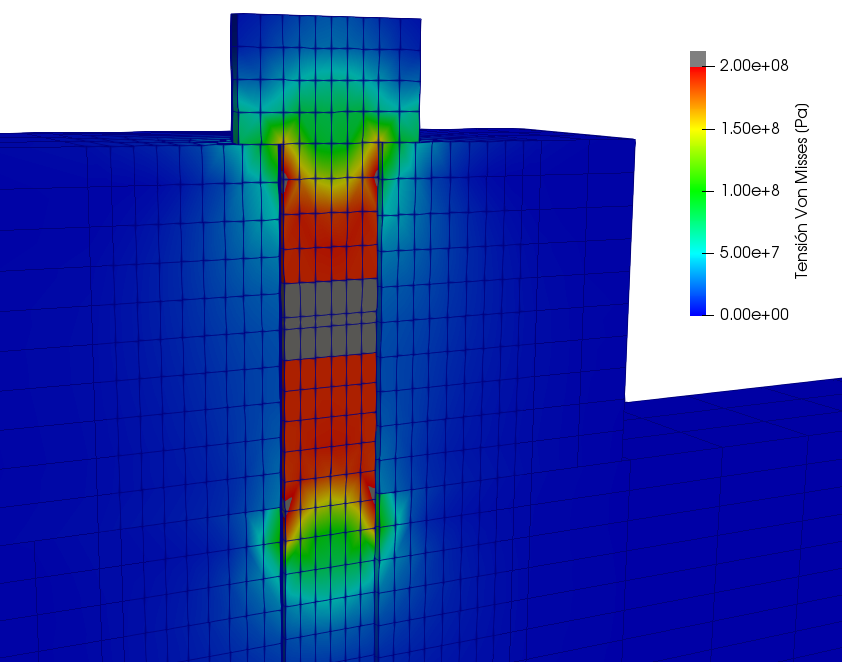
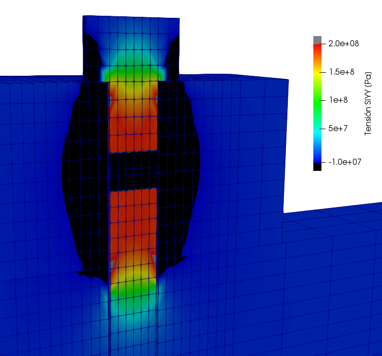
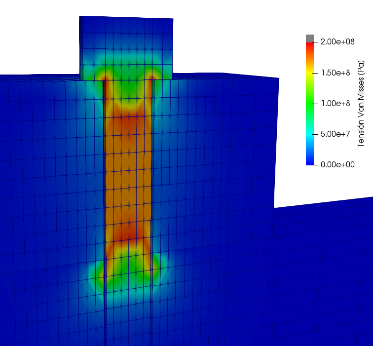
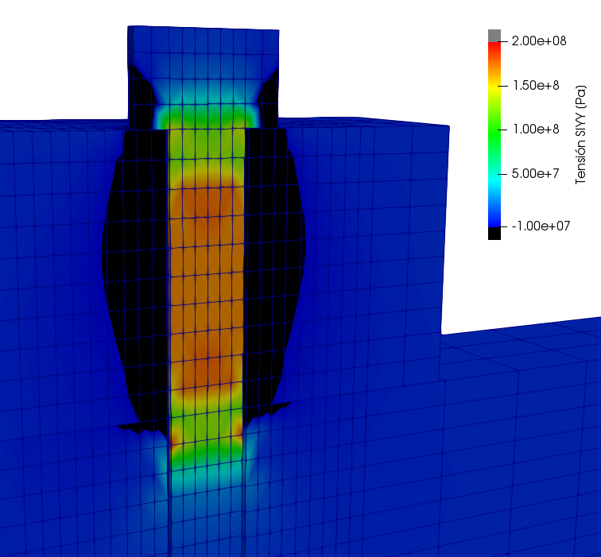
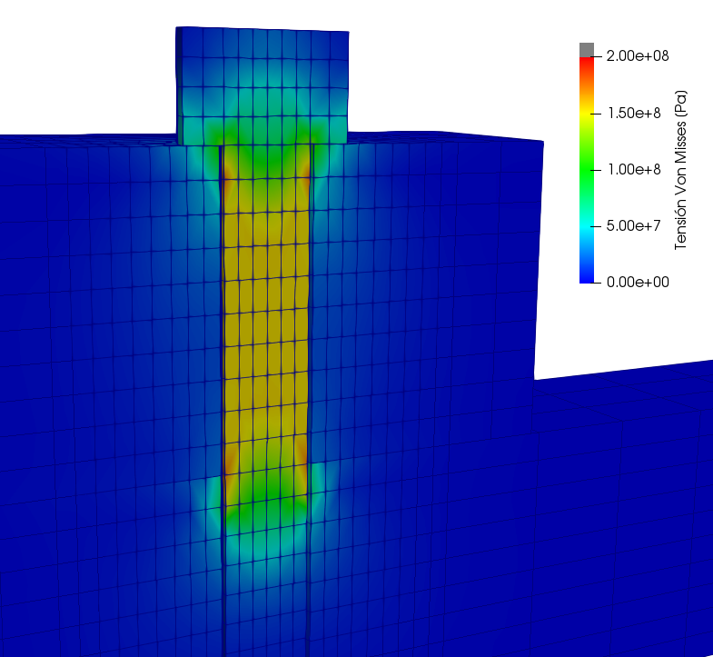
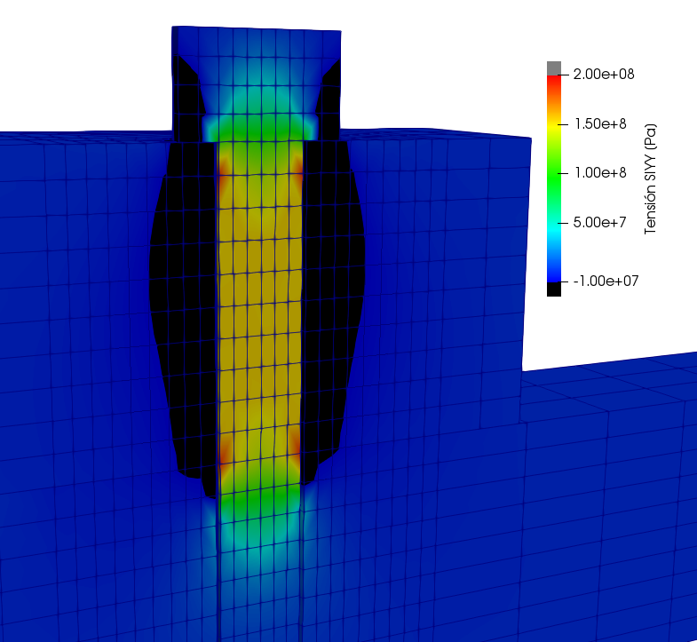

# CA_bolt_pretension

Some methods to apply prestressing in solid bolts in Code_Aster.

## Some Considerations

- The prestressing load (200MPa) should only be applied to the bolt

## Method 1: Use pre_epsi

Use pre_epsi to apply a deformation in a small central area of the bolt which corresponds to the tightening torque required

Command file: Bolt_pre_epsi.comm

## Method 2: Use initial temperature gradient

Use an initial temperature gradient that corresponds to the prestressing load

Command file: Bolt_pre_temp.comm

## Method 2: Use stress inital condition

Impose a field of initial stress equal to the prestress load in the indicated area.

Command file: Bolt_crea_resu.comm